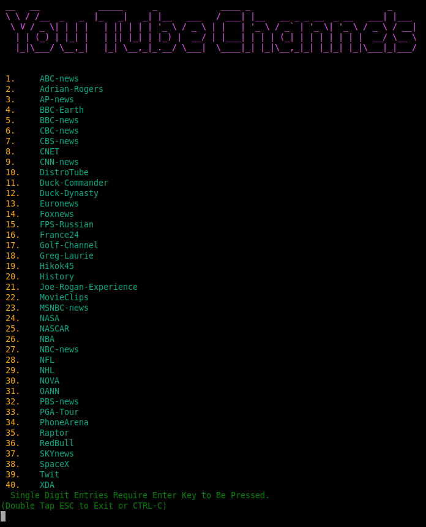
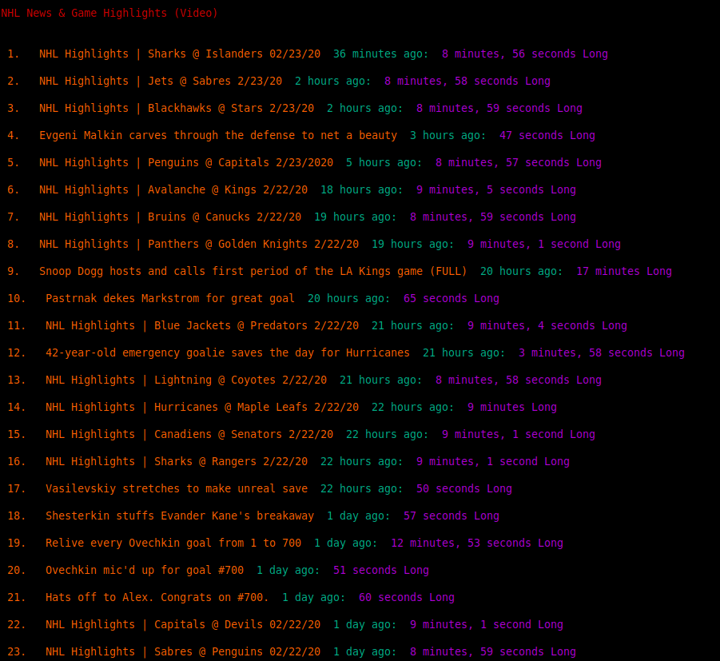

## A universal script to view any youtube channel video without going to youtube.com in your browser.

Watch Youtube Videos without going to the youtube site. (Either on your local display or chromecast)

This script is faster than going to youtube and selecting your video of interest.

These files will fetch the latest 99 videos (or whatever # you want) and display it to you in the terminal.

Make your selection and the video will open on your local screen or a chromecast device. (MPV used for local & MKchromecast used for casting).

Edit the config file and add your channels

##### {Menu Entry}

###### NHL

###### Title="The official YouTube page of the NHL"

###### Channel="NHLVideo"

##### ChannelURL=https://www.youtube.com/user/"${Channel}"/videos

# Installation
Make ytVideo file executable before using this script.

Edit the ytVideo file and change the location variable to match the location where you stored the config file.
config=""$HOME"/Scripts"

Then run the ytVideo file and select your channel. Then select your output type (local screen or chromecast). Wait a few seconds and your video will play.

# Requirements:

curl (for fetching the channel html source) available from your distro repository.

mpv (for playing the videos) most likely available from your distro repository or https://mpv.io/installation/

yt-dlp (for grabbing the url and titles) yt-dlp install instructions https://github.com/yt-dlp/yt-dlp

Optional:

MKchromecast (for casting the video to your chromecast device) likely available from your distro repository or https://mkchromecast.com/#installation

I have included a bunch of sample channels to get you started.
